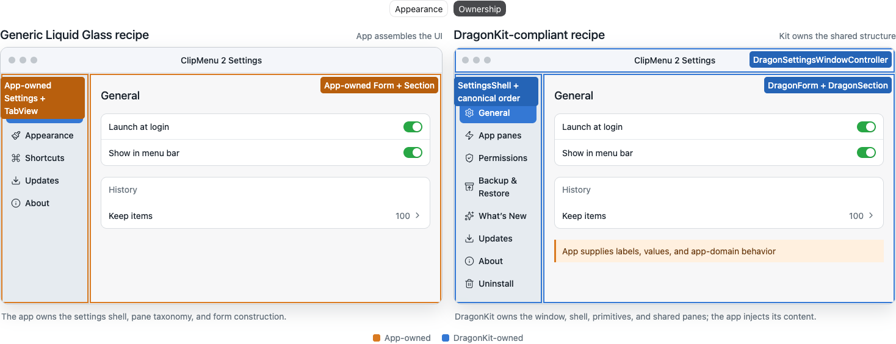
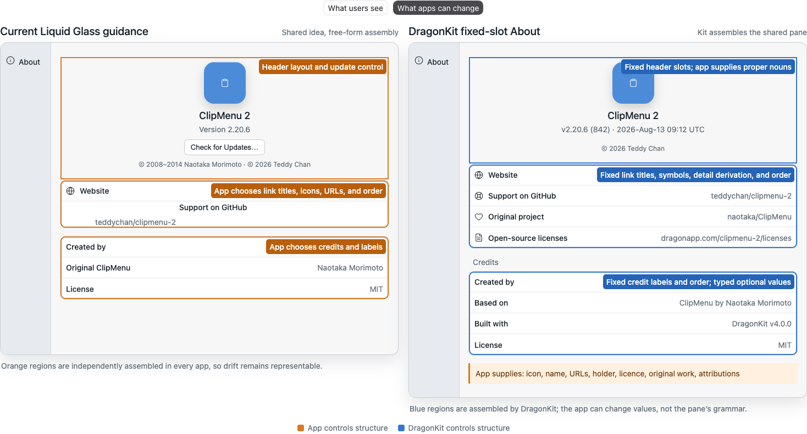
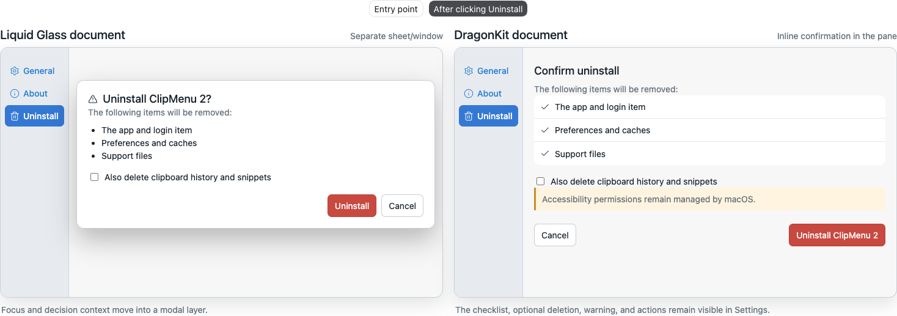
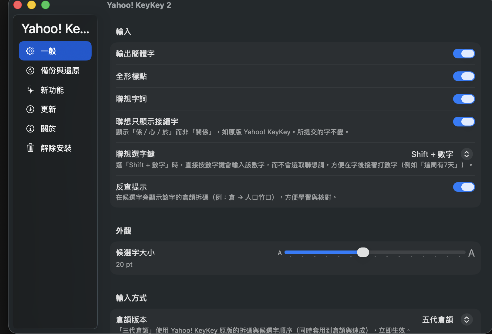

# Adopt-DragonKit prompt

A ready-to-paste prompt for a **new chat session inside one of the app repos** (ClipMenu,
KeyKey, Ice, …). It tells the agent to depend on DragonKit and move the app's common macOS
features and UI onto the shared modules — without copying kit code. Most Dragon apps
use an `NSStatusItem`; Yahoo KeyKey is a system-managed Input Method Kit app. Both use the same
DragonKit Settings UI, with host-specific lifecycle and backend behavior.

Paste the block below, then apply the per-app tweaks noted underneath.

> **Maintainers:** a prompt is pasted into a context where this repository is absent, so it names
> rules the agent would otherwise have to fetch. That duplication is deliberate — but it is
> *derived*, never authoritative. The block below names rules; it does not restate their content,
> and where the two disagree `CONFORMANCE.md` wins.
>
> <!-- MIRRORS: CONFORMANCE §R0 §R1 §R2 §R3 §R5 §R6 §R7 §R9 §R10 §R11 §R12 §R13 · MAC-APP-RELEASE-LIFECYCLE (Debug identity, tag namespace) -->
>
> The marker must be **exhaustive, not illustrative** — it is the only enforcement these files
> have. A change to any mirrored rule must update this file and
> [`IMPLEMENT-MAC-APP-RELEASE-LIFECYCLE-PROMPT.md`](IMPLEMENT-MAC-APP-RELEASE-LIFECYCLE-PROMPT.md)
> in the same PR; `.claude/skills/dragonkit-review/SKILL.md` asks a reviewer to check that.

## Visual ownership guide

Liquid Glass defines the appearance. DragonKit owns the shared Settings structure and leaves
app-specific labels, values, and domain behavior to the app:



The same boundary applies inside shared panes. For example, DragonKit fixes the About grammar
and presents uninstall confirmation inline; the app supplies typed content and cleanup behavior:





---

```
Adopt the shared DragonKit template for this app's common macOS features and UI.

DragonKit is our published SwiftPM package that owns the shared parts of every Dragon
macOS app, so each app builds them once and updates them centrally. First identify the host:
- An `NSStatusItem` menu-bar app owns a status-item menu and normally includes Quit.
- An Input Method Kit app owns an IMK input menu, is launched and quit by macOS, and has no
  `NSStatusItem` or Quit command.
This topology changes menu hosting and app-specific backend operations, not the shared Settings
window. Both host types use DragonKit's shell, design primitives, pane UI, and canonical ordering.
- Repo: https://github.com/teddychan/dragon-kit  (local clone: ~/git/dragon-kit)
- Depend on it at a version tag — DO NOT copy its source into this app. First identify the
  product build's dependency mechanism. Use the NEWEST vX.Y.Z tag (check
  `git tag --sort=-v:refname` in ~/git/dragon-kit); a pin behind the newest tag fails
  conformance §R10. For a product whose top-level build graph is SwiftPM, use:
      // X.Y.Z = the newest tag:
      //   gh release view --repo teddychan/dragon-kit --json tagName -q '.tagName | ltrimstr("v")'
      .package(url: "https://github.com/teddychan/dragon-kit", from: "X.Y.Z")
  KeyKey is different: its product build pins `DRAGONKIT_TAG` in `tools/build-app.sh`, resolves
  DragonKit under gitignored `vendor/dragon-kit`, builds the kit with SwiftPM, and links the
  resulting static libraries from its direct-`swiftc` app build. Preserve that verified path.
- Two products:
    • DragonKit         — core, no external deps
    • DragonKitUpdates  — adds Sparkle; link ONLY in a direct-download build,
                          NOT in a Mac App Store build.

FIRST, before writing code, read these (they are the source of truth):
  1. ~/git/dragon-kit/CONFORMANCE.md  — NORMATIVE. All current rules are machine-checked by
     ~/git/dragon-kit/Scripts/dragon-conformance.py, which runs in this app's CI, so a
     violation fails the PR. Read it first: it defines what "adopted" actually means.
  2. ~/git/dragon-kit/docs/MAC-APP-RELEASE-LIFECYCLE.md — canonical Debug/test/tag/release/site
     lifecycle. Debug is local only, never part of a version, tag, prerelease or public artifact.
     Every app, including Dragon Sample App, uses exactly vX.Y.Z for public releases. One repo
     owns one public tag series; never add an app-specific tag prefix.
  3. ~/git/dragon-kit/docs/STARTING-A-NEW-APP.md  — self-contained guide + starter files
  4. github.com/teddychan/dragon-sample-app  — a runnable reference app, in its own repo,
     wiring up EVERY module end-to-end (esp. Sources/DragonAppTemplate/AppDelegate.swift and
     the *Config.swift files). Mirror its patterns. It is not inside dragon-kit: one repo owns
     one public vX.Y.Z series, and the kit's belongs to the package.
  5. ~/git/dragon-kit/README.md  — module list

GOAL: replace this app's bespoke implementations of these features with DragonKit
modules, supplying only this app's own content/config. Use:
  • Design primitives — DragonForm, DragonSection, .dragonAnnotation (grouped-Form look)
  • Settings shell    — SettingsShell (host-owned selection) + DragonSettingsWindowController;
                        each screen conforms to SettingsPane.
                        NOTE: SettingsPane.title is a localization KEY (String), rendered via L().
  • App Settings      — DragonSettingsStore<Value> (Codable persistence in a UserDefaults
                        suite) + LoginItem where launch at login applies (not an IME)
  • About             — AboutContent + AboutSettingsPane. Do not put Check for Updates in
                        About; updates belong in the shared Updates pane and lifecycle menu.
  • What's New        — WhatsNewContent / ChangeSection + WhatsNewSettingsPane
  • Permissions       — DragonPermission (.accessibility() / .screenRecording()) +
                        PermissionsSettingsPane when the app needs a TCC grant. An IME that
                        needs none declares the `no-permissions` trait and omits the pane.
  • Backup & Restore  — DragonBackup + BackupSettingsPane (BackupConfig)
  • Lifecycle menu    — DragonAppMenu.menu(Config) / .items(Config). REQUIRED (§R1): the
                        About / Check for Updates / Settings / Quit items MUST come from the
                        kit — never a hand-built NSMenuItem. Order, titles, casing, ellipses
                        and SF Symbols are canon. The host may be an `NSStatusItem` menu or an
                        IMK input menu. `onCheckForUpdates: nil` omits the update item (Mac App
                        Store); `includeQuit: false` is required for an IME because Quit does not
                        apply. Uninstall is deliberately NOT in the menu (§R2).
  • Uninstall         — DragonUninstaller + UninstallSettingsPane (UninstallConfig);
                        it confirms INLINE in the pane (no popup window)
  • Updates           — (DragonKitUpdates) DragonUpdater + UpdatesSettingsPane
  • Localization      — L(_:), LocalizationManager, LanguagePicker, .dragonLocalized().
                        Ships 7 languages (en, es, fr, ja, ko, zh-Hans, zh-Hant) and
                        switches language LIVE, no restart. This app supplies its own
                        Localizable.strings per language and drops in LanguagePicker.

Settings pane (sidebar) order — list panes in settingsPanes in this order, so every
Dragon app's Settings sidebar matches (the order is host-owned; the shell just renders
what you give it):
  General → (this app's own panes) → Permissions (when applicable) → Backup & Restore → What's New → Updates (when applicable) → About → Uninstall
If the app declares `no-permissions`, omit only Permissions and preserve the relative order of
every remaining pane. Yahoo KeyKey's current sidebar is General → Backup & Restore → What's New
→ Updates → About → Uninstall.

Host wiring:
  • For an NSStatusItem app, copy dragon-sample-app's AppDelegate pattern and build the menu with
    DragonAppMenu.menu(...) — NOT a hand-rolled lifecycle menu. Rebuild it on
    .dragonLanguageChanged so the titles switch language live.
  • For an IME, retain the system-owned IMK menu host and verify its documented integration point.
    Build the app's own input-method items, add a separator, then append
    DragonAppMenu.items(DragonAppMenu.Config(…, includeQuit: false)). Verify how that IMK host
    dispatches top-level selections before relying on the items' original targets. KeyKey retargets
    the kit-created items to @objc selectors on InputController and forwards from there to its
    host-owned controller. This is a menu-host difference only; do not create a different Settings
    shell or shared-pane UI.
  • Host-owned selection so a menu item can open Settings directly on a specific pane
    (e.g. About).
  • Apply .dragonLocalized() at the settings root so the window switches language live;
    rebuild the panes on language change so injected content (About/What's New) re-localizes.
  • Version is single-sourced from Info.plist (CFBundleShortVersionString /
    CFBundleVersion) — never hardcode it. Use DragonAbout.versionString() for the About
    pane; it formats as "v<short> (<build>) · <UTC commit time>".
  • Debug keeps CFBundleShortVersionString numeric and unchanged. Render "Debug" from build-
    channel metadata and use <release-bundle-id>.debug so it runs independently beside Release.
  • A public release tag is exactly vX.Y.Z. No sample-v/mas-v/app-v/release-v prefix is allowed.
    Debug has no tag, and every distribution channel consumes the same exact app release tag.

CONSTRAINTS:
  • Depend on DragonKit; never fork or re-implement its shared behavior. If a shared
    layout/behavior needs changing, that change belongs in dragon-kit (new tag), not here.
  • Only this app's content/config lives here: About text, What's New entries, settings model,
    permission list when applicable, BackupConfig, UninstallConfig, DragonUpdater, app-specific
    settings panes, backend operations, and the app's own Localizable.strings.
  • Keep this app's existing feature logic intact — only swap the settings/About/What's New/
    Permissions/Backup/Uninstall/Updates/Localization UI over to DragonKit.
  • No app type may shadow a public DragonKit type name (§R3) — e.g. a local
    UpdatesSettingsPane, BackupSettingsPane or UninstallView. Delete the app's copy and use
    the kit's. Nested types (Foo.BackupError) are fine; top-level ones are not.

DONE means the conformance checker passes, not that it compiles:
  • Add .dragon-conformance.json at this repo's root (schema in CONFORMANCE.md §R0). The pin
    pattern MUST be anchored on dragon-kit — an unanchored version regex matches whichever
    dependency appears first in the file and silently reports a false PASS.
  • Add .github/workflows/conformance.yml calling
    `uses: teddychan/dragon-kit/.github/workflows/conformance.yml@main` (@main is deliberate;
    there is no floating v2 tag and the kit is read at its default branch anyway).
  • Run it locally until clean:
      python3 ~/git/dragon-kit/Scripts/dragon-conformance.py --app . --kit ~/git/dragon-kit
  • A genuine, sanctioned divergence goes in `exceptions` with a `reason` and a `sanctionedBy`
    — only when an applicable rule genuinely fires after supported parameters, traits and slot
    spellings have been used. A different host topology is not itself an exception.

Start by reading the docs + sample-app, then propose a short migration plan (which screens map
to which modules, what config each needs) before changing code. Include the current checker
output in that plan — it is the machine-readable version of this app's adoption backlog.
```

---

## Per-app tweaks (edit before pasting)

- **Sparkle / `DragonKitUpdates`** — for an app with both a Mac App Store build and a free
  build (e.g. ClipMenu), link `DragonKitUpdates` **only** in the direct-download target; the
  MAS target links `DragonKit` only. For a direct-download-only app, link both everywhere.
- **Permission type** — name the permission the app actually needs instead of the generic
  placeholder. Yahoo KeyKey receives keystrokes through IMK and needs no Permissions pane; use
  the `no-permissions` trait. Do not add a grant merely to match an `NSStatusItem` app.
- **Version pin** — set `from:` to the newest DragonKit tag
  (`gh release view --repo teddychan/dragon-kit --json tagName -q '.tagName | ltrimstr("v")'`)
  (`git tag --sort=-v:refname` in `~/git/dragon-kit`); §R10 fails anything older.
- **Menu omissions** — pass `onCheckForUpdates: nil` for a Mac App Store target and
  `includeQuit: false` for an IME. These are first-class `DragonAppMenu.Config` parameters —
  the canon's supported host/channel rules, not R11 exceptions and not reasons to hand-roll the
  lifecycle items.

---

## Input-method (IMK) and build topology

**yahoo-keykey-2** is an Input Method Kit app with a verified script/SwiftPM hybrid build. Detect
this from the repository rather than from historical guidance: there is no top-level
`Package.swift`, `.xcodeproj`, or `.xcworkspace`; `tools/build-app.sh` is the product-build entry
point; `.github/workflows/release.yml` selects the reusable release workflow's `script` front end;
and the manifests under `Packages/KeyKeyEngine` and `Packages/KeyKeyApp` are test packages. The
script compiles KeyKey with direct `swiftc`, builds the pinned checkout under `vendor/dragon-kit`
with SwiftPM, archives the DragonKit objects into static libraries, links both kit products, and
copies `DragonKit_DragonKit.bundle` into `YahooKeyKey2.app`. Its menu host and backend operations
differ, but its Settings window does not get a separate design system. Apply these points; none is
a licence to skip an applicable rule or reimplement a shared pane.

The existing Settings window demonstrates the intended UI topology: the same sidebar-based app
Settings UI, with KeyKey-specific input panes and no Permissions pane. Its IME lifecycle separately
means there is no Quit command.



This screenshot demonstrates Settings information architecture only; it does not evidence menu
hosting, Quit behavior, launch behavior, or uninstall implementation.

- **Settings UI stays shared** — use the same `DragonSettingsWindowController`, `SettingsShell`,
  `DragonForm`/`DragonSection`, `AboutSettingsPane`, `BackupSettingsPane`,
  `WhatsNewSettingsPane`, `UpdatesSettingsPane`, and inline `UninstallSettingsPane` as an
  `NSStatusItem` app. KeyKey owns its input-method settings content and supplies its verified
  configuration inputs, not a parallel shell, parallel shared-pane presentation, or inferred
  backend hook. Omit Permissions through the declared
  `no-permissions` trait; preserve the relative order of every remaining shared pane.

- **Menu** — an IMK app has no `NSStatusItem`; it retains its system-owned IMK menu host. Verify
  the host's documented integration point, build the app's own input-method items, add a separator,
  then append `DragonAppMenu.items(DragonAppMenu.Config(…, includeQuit: false))`. §R1 applies to
  an IMK menu exactly as it does to a status-item one — the lifecycle items still come from the kit.
  In current KeyKey, do not remove the dispatch adapter after appending them: it matches each
  kit-created item by its kit-created localized title, retargets it to an `@objc` selector on
  `InputController`, and forwards About, Updates, and Settings to `AppMenuController`. The adapter
  is required because the IMK host routes top-level selections back to the input controller; the
  item set and canonical presentation still come from DragonKit.
  `includeQuit: false` because an IME is quit by the system; quitting it only makes typing
  unresponsive. This is the supported IME topology, not an exception. **Do not route an Uninstall
  item into this menu** — §R2 forbids it everywhere,
  and `DragonAppMenu.Config` has had no such parameter since v2.0.0. Uninstall is
  `UninstallSettingsPane`, last in the Settings sidebar, for an IME too.

- **Backend behavior is app-specific** — shared pane UI does not imply identical operations.
  Current KeyKey supplies `UninstallConfig` for its defaults, learning-data directory, cache,
  bundle, and conditional Homebrew receipt; DragonKit clears those targets, moves the running
  bundle to Trash, and terminates after success. There is no `TISDisableInputSource`, input-source
  unregister operation, active-source switch, or custom uninstall-operation hook in the current
  implementation. Removing KeyKey from Input Sources in System Settings and logging out when
  needed are separate user steps. Do not document automatic TIS cleanup unless a future runtime
  implementation adds and verifies it.

- **Build integration (verified KeyKey path)** — a remote `.package(url:…, from:…)` line in either
  nested test manifest does not build the app. Retain `tools/build-app.sh` as the product entry
  point: resolve its `DRAGONKIT_TAG` into `vendor/dragon-kit`, run `swift build -c release` there,
  archive the emitted `DragonKit` and `DragonKitUpdates` objects, link those archives/modules into
  the app's direct `swiftc` invocation, and copy the SwiftPM resource bundle into
  `Contents/Resources`. Local clean builds first generate `Resources/data.txt` with
  `tools/build-lm.sh`; the release workflow does the same before invoking `tools/build-app.sh`.

- **Declaring a script-build pin (§R10)** — when there is no top-level product `Package.swift`, the
  checker reads whatever file states the version. Point `pin.file` at the build script and anchor
  `pin.pattern` on the variable that holds the tag, e.g. `DRAGONKIT_TAG="([0-9.]+)"`. The anchoring
  requirement and the trap behind it are in the prompt block above, once.

- **Permissions (§R5)** — don't add a Permissions pane an app doesn't need. An IME receives
  keystrokes through the IMK server, so it needs no Accessibility or Input-Monitoring grant.
  Omitting the pane is a *declared* omission, not a silent one: add `"no-permissions"` to
  `traits` in `.dragon-conformance.json` and R5 stops requiring it. This is compliant capability
  configuration, not a sanctioned §R11 exception.

- **Distribution** — a third-party input method can't ship on the Mac App Store, so it stays
  direct-download + Homebrew: link **both** `DragonKit` and `DragonKitUpdates`, and keep
  Sparkle. The `mac-app-store` trait does not apply; `sparkle` does.
