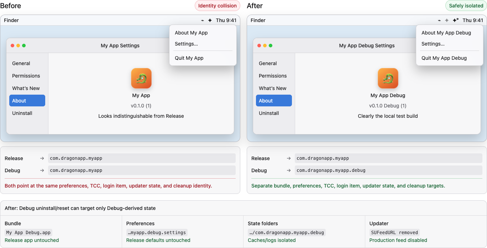

# Documentation rule-conflict changelog

**Status: CLOSED — archive.** No entries are being added. Review checkpoint 2026-08-13; all seven
decisions re-checked against the normative documents on 2026-08-15 and all seven still hold.

**Scope:** documentation changes only; entry 7 records read-only KeyKey implementation evidence

This records owner-approved resolutions from the documentation conflict audit. Entries 1–4 cover
shared UI ownership, entry 5 fixes Debug identity, entry 6 records the app-repository and
release-ownership boundary, and entry 7 records KeyKey's verified integration topology. It is
intentionally separate from the normative rules so a reviewer can evaluate what changed, why it
changed, and whether the ownership boundary is correct.

**It is not a rule and it does not override one.** Where a decision below and a normative document
differ, [`../CONFORMANCE.md`](../CONFORMANCE.md) or
[`MAC-APP-RELEASE-LIFECYCLE.md`](MAC-APP-RELEASE-LIFECYCLE.md) wins and this file is stale. A later
doc-conflict pass should open a new register rather than extend this one, so each pass stays
readable as the record of one review.

## Decision summary

| Priority | Conflict | Resolution | Why |
|---:|---|---|---|
| 1 | Liquid Glass described app-local Settings assembly while DragonKit requires shared Settings primitives. | Liquid Glass owns appearance; DragonKit owns the shared window, shell, pane structure, primitives, and canonical order. | It preserves the visual language without allowing every app to recreate shared structure. |
| 2 | Liquid Glass allowed a free-form About view while DragonKit 4 uses fixed slots. | Use `AboutContent` with `AboutSettingsPane`; DragonKit fixes labels, icons, URL details, order, version format, and the Built-with row. | Typed app content remains flexible while cross-app layout and wording cannot drift. |
| 3 | Liquid Glass required a separate uninstall sheet/window and `NSAlert` button rules while DragonKit presents confirmation inline. | DragonKit owns inline presentation. Apps supply cleanup paths, optional-data configuration, and truthful app-specific explanation. | One confirmation UI serves every app without pretending that every app performs the same cleanup. |
| 4 | The adoption prompt treated every Dragon app as an `NSStatusItem` menu-bar app and described Yahoo! KeyKey differences as exceptions. | Distinguish `NSStatusItem` and Input Method Kit hosts while retaining the same DragonKit Settings UI. KeyKey uses no Quit, launch-at-login, or Permissions pane; its input settings and uninstall configuration remain app-specific. | Host lifecycle and backend inputs differ, but that does not require a different Settings design system or unverified cleanup hook. |
| 5 | The new-app guide required an isolated Debug identity while its executable scaffold still packaged and addressed the release identity. | Package `<App> Debug.app` with executable `<App> Debug`, bundle id `<release-id>.debug`, Debug channel metadata, bundle-derived UI/state paths, and Debug-only cleanup. | A developer following the guide can run Debug beside Release without sharing TCC, preferences, login/status state, updating, or destructive targets. |
| 6 | The lifecycle implementation prompt allowed an in-tree Sample App fixture even though the accepted lifecycle requires a separate app repository. | Prohibit any in-tree consuming app or app-release infrastructure; make each app repository the sole owner of its complete release surface. | One app copy and one release owner prevent source drift, competing tag namespaces, and split ownership of builds, releases, artifacts, appcasts, downloads, and operations. |
| 7 | KeyKey guidance disagreed about its build system, IMK dispatch, and TIS/uninstall behavior. | Record the verified direct-`swiftc` product build plus nested SwiftPM test packages and SwiftPM-built DragonKit; retain KeyKey's selector-retarget IMK adapter; document Settings-only uninstall and the absence of automatic TIS deregistration. | Current source, executable configuration, and release workflow establish this topology; the previously described TIS hook does not exist. |

## 1. Liquid Glass appearance vs DragonKit structure

The two sides may look similar by design. The change is who controls the reusable structure:
orange is app-assembled; blue is DragonKit-assembled. Apps still supply their own labels, values,
settings state, and domain behavior.

## 2. Free-form About vs fixed-slot About

The fixed-slot model makes row names, symbols, order, canonical URL details, version presentation,
and the DragonKit credit consistent. Apps retain the icon, name, URLs, holder, licence, original
work, and attribution values.

## 3. Separate uninstall sheet vs inline confirmation

The useful behavioral requirements remain: an explicit removal checklist, an optional user-data
toggle off by default, safe cancellation, visible failures, and an honest explanation of what
macOS controls. Only the competing sheet/window/`NSAlert` presentation rules were removed. The
image illustrates presentation only; it does not establish custom cleanup hooks or runtime behavior.

## 4. Yahoo! KeyKey uses the same Settings UI, not the same lifecycle

This screenshot demonstrates Settings information architecture only; it does not evidence menu
hosting, Quit behavior, launch behavior, or uninstall implementation.

| Shared with other Dragon apps | Specific to Yahoo! KeyKey |
|---|---|
| `DragonSettingsWindowController`, `SettingsShell`, shared pane UI, design primitives, and relative sidebar order | Input-method preferences and help content |
| About, Backup & Restore, What's New, Updates, and inline Uninstall presentation | IMK `menu()` host instead of `NSStatusItem` |
| DragonKit lifecycle-menu labels and ordering where an item applies | `includeQuit: false`; macOS manages the IME lifecycle |
| Trait-driven omission of inapplicable panes | `no-permissions`; no launch-at-login; input-source removal remains a separate system/user step |

The resulting KeyKey order is **General → Backup & Restore → What's New → Updates → About →
Uninstall**. Omitting Permissions and Quit is supported host/capability topology, not an R11
exception and not permission to hand-roll the remaining shared UI. The implemented uninstall
clears KeyKey's configured defaults/files, moves the running bundle to Trash, conditionally clears
its Homebrew receipt, and terminates after success. It has no TIS deregistration or custom-operation
hook; removing the input source in System Settings and logging out when needed remain separate
steps.

## 5. Isolated Debug rule vs release-identity scaffold

The old `scripts/run.sh` assembled `<App>.app`, copied the release plist unchanged, and left the
settings window, About pane, menu, explicit settings suite, status-item autosave name, and
uninstall configuration on release literals. It would also copy any later production updater
metadata unchanged. Warning prose above it promised isolation that the executable template did
not implement.

The corrected scaffold keeps the source plist's release behavior but stamps only the locally
assembled bundle as `<App> Debug.app`, `<release-id>.debug`, executable `<App> Debug`, and
`DragonBuildChannel = Debug`. Runtime UI and state come from the built bundle. Debug packaging,
process matching, preferences, caches, logs, HTTP storage, login/status state, updater metadata,
and uninstall/reset paths no longer address Release. Identifiers introduced later by App Groups,
iCloud, Keychain, helpers, XPC/Mach services, locks, sockets, notifications, or custom updater
feeds remain explicit audit points rather than receiving guessed suffixes.

## 6. Lifecycle repository and release ownership

The previous README path could send an agent from the accepted separate-repository lifecycle to a
prompt that still permitted retaining an in-tree app fixture:

The corrected path makes the accepted lifecycle the canonical entry point, requires separate
repository checkouts, and gives each app repository sole ownership of its source, packaging,
workflows, signing/notarization configuration, releases, artifacts, production appcast,
app-side website/download integration, and operational state:

DragonKit owns shared package code, lifecycle and conformance contracts, guidance, and reusable
release conventions. Shared automation may execute steps without becoming a release owner, while
the marketing-site repository consumes successful releases without owning or gating them. This
documentation decision does not claim that any external app repository has completed the
migration.

## 7. Verified KeyKey integration and build topology

The current KeyKey product is not Xcode-owned and is not built by either nested SwiftPM manifest.
`tools/build-app.sh` compiles KeyKey with direct `swiftc`. It resolves the pinned DragonKit tag into
`vendor/dragon-kit`, builds the kit there with SwiftPM so its modules and resource bundle exist,
archives the emitted objects, links both DragonKit products, and assembles the LSUIElement IMK app.
The `KeyKeyEngine` and `KeyKeyApp` manifests serve unit-test and compile-check harnesses. Tagged CI
selects the shared release workflow's `script` front end, which generates the language model when
needed and invokes the same app-build script.

At runtime, KeyKey's `InputController.menu()` owns the flat contents supplied to macOS's IMK menu
host. It builds four KeyKey toggles, obtains About/Check for Updates/Settings from
`DragonAppMenu.items`, then retargets those kit-created items to selectors on `InputController`.
Those selectors forward to KeyKey's `AppMenuController`, which selects the correct shared Settings
pane and invokes `DragonUpdater` where applicable. This adapter is the verified DragonKit boundary;
guidance that appends the closure-backed items without preserving it is incomplete.

## Independent-review corrections

Before publication of entries 1–4, an independent documentation-only review returned **REVISE
BEFORE CONTINUING**. That review included the resulting corrections:

- replaced remaining blanket “menu-bar app” language with explicit `NSStatusItem` and IMK hosts;
- made `DragonAppMenu` responsible for applicable lifecycle items rather than asserting every host
  has the same menu;
- limited shared uninstall guidance to presentation invariants and left cleanup targets/order to
  each app;
- first marked KeyKey's TIS cleanup integration point as unverified, then removed that proposed
  hook after the implementation review established that none exists;
- limited the KeyKey screenshot to evidence of Settings information architecture;
- corrected the About timestamp to UTC commit time with seconds and labeled obsolete visual
  guidance as previous guidance; and
- described `SyncBackupPane` as an R9 slot spelling rather than an R11 exception.

## Files that carried these changes

The decisions above landed across `README.md`, `CONFORMANCE.md`,
[`MAC-APP-RELEASE-LIFECYCLE.md`](MAC-APP-RELEASE-LIFECYCLE.md),
[`STARTING-A-NEW-APP.md`](STARTING-A-NEW-APP.md),
[`ADOPT-DRAGONKIT-PROMPT.md`](ADOPT-DRAGONKIT-PROMPT.md),
[`IMPLEMENT-MAC-APP-RELEASE-LIFECYCLE-PROMPT.md`](IMPLEMENT-MAC-APP-RELEASE-LIFECYCLE-PROMPT.md),
`docs/images/doc-rule-conflicts/*.png`, and the archival banners now indexed by
[`history/README.md`](superpowers/README.md).

The matching Liquid Glass wording was updated in `~/.claude/skills/liquid-glass-macos/`
(`SKILL.md`, `references/swiftui-recipes.md`, `references/per-app-specs.md`, and the mirrored
`assets/doc-rule-conflicts/*.png`). Those files are **not part of this Git repository** and can
drift from it without any CI noticing — which is why entry 1's ownership boundary is restated
inside the skill itself rather than only here.

## Review boundaries

- Entries 1–6 record documentation and image decisions; they do not establish source-code or
  API-support claims merely because the desired boundary is stated.
- Entry 7 is narrower and explicitly source-verified against the current KeyKey repository's
  build script, release workflow, menu adapter, Settings assembly, and uninstall configuration.
  That review was read-only and changed no KeyKey implementation.
- In particular, verify that IMK menu hosting remains separate from Settings UI ownership and that
  KeyKey-specific uninstall behavior is not being generalized into menu-bar app behavior.
- Other audit findings remain out of scope unless they are added as an explicit decision here.
