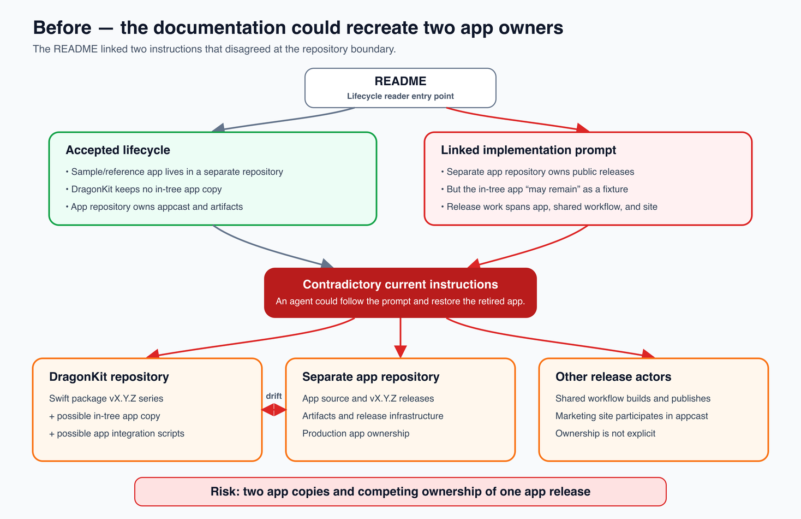
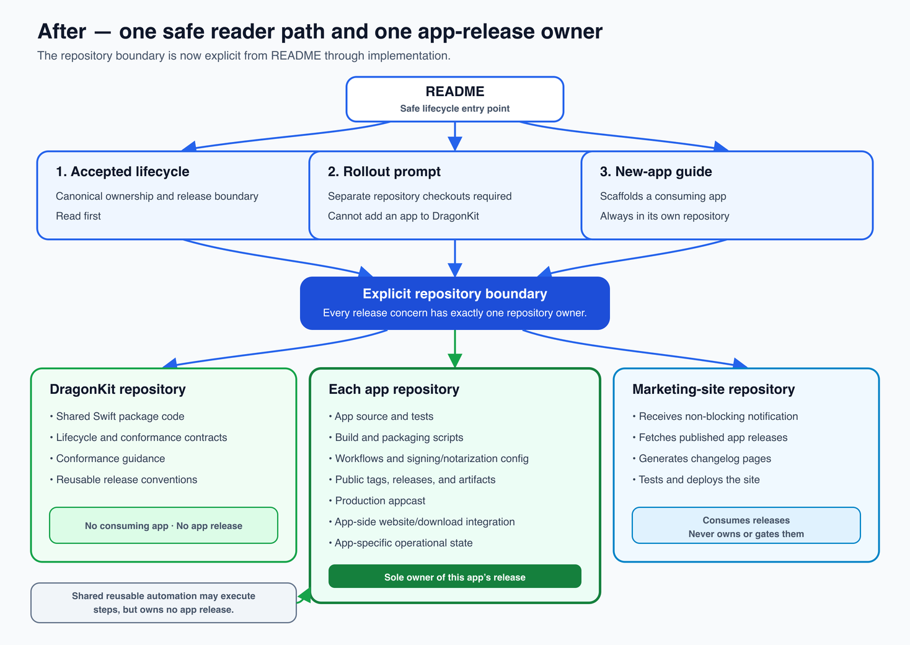
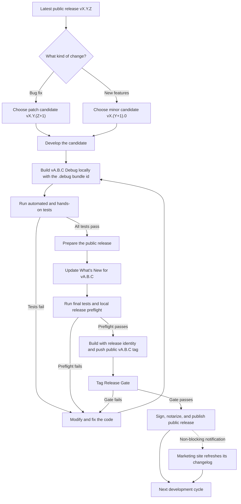

# Dragon macOS app release lifecycle

**Status:** Accepted

**Applies to:** Every Dragon macOS app

**Decision date:** 2026-08-10

This is the canonical release process for Dragon macOS apps. It defines the boundary between
local development, a public app release, and the marketing site so those three concerns cannot
silently acquire competing version numbers or block one another.

## Repository boundary

DragonKit owns the shared Swift package code, lifecycle and conformance contracts, conformance
guidance, and reusable release conventions. Its repository contains no consuming app and owns no
app build, app release, downloadable app artifact, or production appcast.

Each consuming app, including Dragon Sample App, lives in its own repository. That app repository
owns the app source and tests; build and packaging scripts; workflows, including
reusable-workflow callers; signing and notarization configuration; version and What's New
content; public tags and releases; downloadable artifacts; production appcast; website and
download notification integration on the app side; and app-specific operational
configuration and state. It may call shared reusable automation, but that does not transfer
release ownership away from the app repository.

The marketing-site repository owns only the site source, build, tests, deployment, changelog
cache, and recovery process. It consumes successful app releases asynchronously; it does not own
or gate them.

### Reader path and ownership: before and after

The superseded reader path linked an accepted separate-repository rule to an implementation
prompt that still allowed an in-tree app fixture. That could recreate two copies of one app and
split release ownership:

The current path makes the repository boundary a prerequisite and assigns every release concern
to exactly one repository owner:

## The model

There is one public release channel. During development, the local Debug build uses the version
planned for the *next* public release; `Debug` identifies its build configuration, not a separate
version lineage.

| Concern | Identity |
|---|---|
| Latest public app | Published `vX.Y.Z` with the release bundle identifier |
| Local Debug build | Next candidate `vA.B.C Debug` with the `.debug` bundle identifier |
| Next public app | The same candidate becomes `vA.B.C` after all tests pass |
| Marketing site | Its own commit/deployment revision; it displays published app releases |

A Debug build is the local, testable form of the intended next public version. It is not another
app product, an independently numbered version, a prerelease channel, or a release distributed
to users. macOS gives it a separate local bundle identity so it can run safely beside the
installed release; that is an implementation detail, not a second version stream.

`Debug` is never part of a version number. It is only a naming and build-channel label on a
runtime-independent local bundle. Removing that label and the `.debug` bundle identity exposes
the same tested numeric candidate as the public release.

## Development and release flow

Choose the next candidate version before the Debug loop. The same numeric candidate stays in use
while failed tests lead back to more development. Passing the tests removes the local Debug
presentation and `.debug` identity; it does not assign a different number. There is no Debug tag
between the previous public release and the new public tag.

## Concrete examples

If the latest public release is `v2.10.0`, the next candidate is `2.10.1` for a bug fix or
`2.11.0` for backward-compatible features. Either way the candidate is chosen once and tested
throughout, and the release does not renumber the tested build.

**The version column never contains `Debug`.** It is the numeric candidate at every stage,
including the Debug build — which is why the signal that a build *is* a Debug build gets its own
column here.

| Stage | `CFBundleShortVersionString` | How you can tell it is a Debug build | Bundle identifier | Public? |
|---|---|---|---|---|
| Currently installed release | `2.10.0` | — | `com.example.app` | Yes |
| Local development and testing — bug fix | `2.10.1` | app named `<App Name> Debug`; `DragonBuildChannel = Debug` | `com.example.app.debug` | No |
| Local development and testing — new feature | `2.11.0` | app named `<App Name> Debug`; `DragonBuildChannel = Debug` | `com.example.app.debug` | No |
| Release after every test passes | `2.10.1` or `2.11.0` | — | `com.example.app` | Yes |

`Debug` reaches a person through the app's name, the build-channel key, and the About line it
renders — `v2.10.1 Debug (<build>)`. All three are presentation and build-channel metadata; none
of them is the version field. The `v` prefix is formatting too, supplied by
`DragonVersion.display(_:)`. See [Local Debug identity](#local-debug-identity) for the full field
list, and [Public version rules](#public-version-rules) for why the version field stays numeric.

The successful release changes two things and no others: it drops the Debug channel label and the
`.debug` bundle-identifier suffix.

## Public version rules

`CFBundleShortVersionString` is the sole source of truth for the app's target semantic version.
During local development it contains the next candidate number; after publication that same
number is the latest public version. It contains only `X.Y.Z`: no `v` prefix, `Debug` suffix,
prerelease suffix, or marketing-site revision belongs in it.

- The public release tag is exactly `vX.Y.Z` and must equal the bundle version.
- The user-visible `v` prefix is formatting supplied by `DragonVersion.display(_:)`.
- The Debug build adds a visible `Debug` channel label without changing the numeric candidate.
- The release build uses the same tested candidate and removes the Debug label and `.debug`
  bundle-identifier suffix.
- `CFBundleVersion` identifies the individual build and remains numeric and monotonic.
- About, What's New, update messages, diagnostics, and packaging derive the version from the
  built bundle. App code never hand-types the current version into those surfaces.
- There are no Debug tags, Debug GitHub Releases, Debug appcasts, Debug Homebrew releases, or
  Debug marketing-site events.

## One public tag namespace per repository

Every public Dragon app, including Dragon Sample App, uses exactly `vX.Y.Z`. Prefixes such as
`sample-vX.Y.Z`, `mas-vX.Y.Z`, `app-vX.Y.Z`, or `release-vX.Y.Z` are not permitted. Debug has no
tag at all.

A repository may own only one independently versioned public `vX.Y.Z` release series. DragonKit's
repository already uses `vX.Y.Z` for the Swift package, so an independently versioned Dragon
Sample App cannot publish from that same repository. Treat the Sample App as a normal app:

- its public releases must be owned by a separate app repository with exact `vX.Y.Z` tags;
- its production appcast and downloadable artifacts must be owned by that app repository;
- the kit keeps no in-tree copy of the app. The transitional allowance for one — a source-level
  integration fixture alongside the release-owned copy — expired when the extraction completed on
  2026-08-10. Two copies of one app is drift waiting to happen, and the in-tree copy had already
  begun: it still passed an explicit `version:` to `WhatsNewContent` after the released copy
  stopped. A kit needing integration coverage adds it to the kit's own tests, not a second app;
  and
- existing `sample-v*` tags, releases, and appcast entries are historical migration data only.
  Do not create another one.

The public tag gate is therefore unconditional rather than configurable by prefix: it accepts
only `^v[0-9]+\.[0-9]+\.[0-9]+$`. A manual workflow dispatch must name an existing exact tag or
run as verification-only; a branch name can never become a release version.

Multiple distribution channels do not create multiple version series. For example, a direct
download, Homebrew cask, and Mac App Store submission for one app all consume the same tested
`vX.Y.Z` release. A channel-specific workflow may run separately, but it must reference that
existing exact tag rather than inventing `mas-v*` or another prefixed tag.

## Local Debug identity

Every hands-on development build visibly says `Debug`. Prefer the following local packaging:

| Field | Debug value |
|---|---|
| App display name | `<App Name> Debug` |
| Bundle name and local `.app` filename | `<App Name> Debug` |
| Bundle identifier | `<release-bundle-id>.debug` |
| Build number | Numeric `CFBundleVersion`, normally the git commit count |
| Build channel | A build setting or custom plist key such as `DragonBuildChannel = Debug` |
| Target version | Numeric candidate `CFBundleShortVersionString = X.Y.Z` |
| About display | `vX.Y.Z Debug (<build>)` |
| Update behavior | Disabled; never read or publish the production appcast |

Do not append `(Debug)` to `CFBundleShortVersionString`. The Debug label is presentation and
build-channel metadata. The `.debug` bundle identifier gives macOS a distinct runtime identity
for the local build. It does not establish a second product or release lineage, and it does not
by itself isolate every resource the code may address explicitly.

## One codebase, two runtime identities

Public and Debug are two build configurations of one repository and one codebase. They compile
the same candidate implementation into two bundles:

| | Public build | Local Debug build |
|---|---|---|
| Source and features | Same candidate code | Same candidate code |
| Build configuration | Release | Debug |
| Display name | `<App Name>` | `<App Name> Debug` |
| Bundle identifier | `<release-bundle-id>` | `<release-bundle-id>.debug` |
| Target version | `X.Y.Z` | `X.Y.Z` |
| Public distribution | Yes, after the tag gate | Never |

Do not maintain a copied Debug codebase. Put identity differences in Xcode build settings, the
SwiftPM assembly script, entitlements, or one small bundle-derived identity helper. Business and
feature logic stays shared so the code that passes Debug testing is the code that ships.

The distinct bundle identifier automatically separates the normal bundle-based application
identity, `UserDefaults.standard`, and TCC records. Anything addressed with a hardcoded or
explicit identifier must also be audited and either given a Debug namespace or disabled:

- explicit `UserDefaults` suites and Application Support, cache, database, and backup paths;
- login items, helper bundles, XPC services, Mach services, singleton locks, sockets, ports, and
  distributed-notification names;
- App Groups, iCloud containers, and Keychain access groups;
- Sparkle and any other production update mechanism;
- uninstall operations, which must never target the public bundle from Debug; and
- launch, quit, and cleanup scripts, which must match only the Debug bundle path or process.

Both bundles must be tested running at the same time. Starting, changing settings in, updating,
quitting, or uninstalling the Debug build must not change, terminate, update, or remove the
installed public release. Separate identity prevents collisions; this simultaneous-run test is
what confirms the app has no remaining shared-resource assumptions.

## What's New is part of the release

Every public release updates the in-app What's New content, including maintenance-only releases.
The heading continues to derive its version from `CFBundleShortVersionString`; the notes contain
no separately maintained current-version literal.

The public tag triggers the authoritative release gate. Before signing or notarization, it must:

1. Accept only an exact public `vX.Y.Z` tag.
2. Verify the tag version equals the built app's `CFBundleShortVersionString`.
3. Find the preceding public `vX.Y.Z` tag, excluding unrelated tag families.
4. Require the app's configured What's New source to have changed since that tag.
5. Reject an explicit current-version argument in `WhatsNewContent`.
6. Require meaningful notes or an explicit maintenance-only statement.
7. Run the app's normal automated tests and release checks.

The tag gate, not a pull request, is the release authority. A PR-time check may provide earlier
feedback but cannot replace the tag gate. A local preflight should run the same checks before
the tag is pushed so a simple omission is found while it is still cheap to fix.

If the pushed tag fails, it publishes no app release. Do not delete and move a release tag;
correct the problem, assign a fresh public version, and use a fresh tag.

## Marketing-site separation

The marketing site has no authority over whether an app ships. It owns its repository, build,
tests, deployment revision, changelog cache, and recovery process.

After a public app release succeeds, the release workflow sends a fire-and-forget webhook or
`repository_dispatch`. The site then reads published GitHub Releases and updates itself. The
notification must never make a successful app release fail, and a scheduled site-side refresh
provides a backstop for a missed event.

The site must ignore drafts and prereleases. Its automation may fail, retry, or deploy later
without affecting the signed app, GitHub Release, Homebrew distribution, or Sparkle updates.

Sparkle appcasts are update infrastructure, not marketing content. Each app should host its
production appcast in its own repository so an outage, permission problem, or rejected change in
the marketing-site repository cannot interfere with update delivery. Migrate an existing feed by
mirroring the old and new locations until installed versions have moved to the app-owned URL.

## Ownership summary

| Owner | Responsibilities |
|---|---|
| DragonKit repository | Shared package code, lifecycle and conformance contracts, conformance guidance, reusable release conventions |
| App repository | Source, tests, bundle version, What's New content, build and packaging scripts, workflows (including reusable-workflow callers), signing/notarization configuration, tag gate, public tags and releases, publication, downloadable artifacts, production appcast, app-side website/download notification integration, app-specific operational configuration and state |
| Marketing-site repository | Receive notifications, fetch published releases, generate changelog pages, test and deploy the site |

A centrally maintained reusable workflow may perform build, signing, notarization, or publication
steps, but it is an implementation dependency, not a separate release owner. The app repository
invokes and configures it and remains the sole owner of that app's release.

Dragon Sample App follows the same ownership table as every other app. Its lack of product
features does not make it a special release type; its purpose is to exercise DragonKit end to end.

## Acceptance criteria

The lifecycle is correctly implemented when:

- A developer can repeat the local Debug build-and-test loop without creating any tag or public
  artifact.
- Every local hands-on build visibly says `Debug` while its bundle version remains the numeric
  candidate intended for the next public release.
- The public release uses the exact candidate version that passed the Debug test loop, with the
  Debug label and `.debug` bundle identity removed.
- The installed public release and local Debug build can run simultaneously without sharing
  settings, terminating one another, or targeting one another's update or uninstall paths.
- A public tag cannot publish when the tag, bundle version, or What's New content is stale.
- Every app repository accepts only exact public `vX.Y.Z` tags; the Sample App has no prefixed
  exception and no longer releases from DragonKit's package-version namespace.
- The in-app version is derived from the bundle on every user-visible surface.
- Only a successful public release notifies the marketing site.
- A site failure cannot fail or delay the app release.
- Draft or prerelease GitHub entries never appear in the public changelog.
- Production appcasts are hosted independently from the marketing site.
